# Gesture Appliances Control with Pose Detection - BrainChip AK1000 

Created By:
Christopher Mendez

Public Project Link:
[https://studio.edgeimpulse.com/public/](https://studio.edgeimpulse.com/public/)

## Introduction

Today more than ever we live with smart devices and personal assistants that work together to make our environment a more comfortable, efficient and personalized place. This project aims to contribute to the same field by suggesting a radical change in how we interact with smart things.

Sometimes it can be inconvenient to have to ask a personal assistant to turn our appliances on or off. Because it's simply too late at night to be talking, or because we're watching our favorite movie and we don't want annoying audio interrupting us.

This is why I thought "What if we could control the whole house with just gestures?" It would be amazing to just point to the air conditioner and have it turn on, turn off the light, and turn on our TV.

## Hardware and Software Requirements

To develop this project we will use a BrainChip Akida Development Kit and a Logitech BRIO 4K Webcam, together with an Edge Impulse Machine Learning model for pose identification.

### Akida Dev Kit

It should be noted that this kit is the main component of this project thanks to some interesting characteristics that make it ideal for this use case. This kit consists of a Raspberry Pi Compute Module 4 with Wi-Fi and 8 GB RAM, also its IO Board, which includes a PCIe interface to carry an **Akida PCIe board** with the **AKD1000 Neuromorphic Hardware Accelerator**. 

Considering that our project will end up being one more smart device that we will have at home, it's crucial that it can do its job efficiently and with very low energy consumption. This is where BrainChip's technology makes sense. Akida™ neuromorphic processor mimics the human brain to analyze only essential sensor inputs at the point of acquisition—processing data with unparalleled performance, precision, and economy of energy.

### Software

The whole system will be running independently identifying poses, if a desired pose is detected it will send an HTTP post to the Google Assistant SDK being hosted by a Raspberry Pi with Home Assistant OS. 

## Setting up the Development Environment

The system comes with the basic requirements installed to run machine learning models using Akida processor acceleration. Once the system is powered up and connected to the internet (I used an ethernet cable), you can access it by an SSH connection, you will need to know the device's local IP address, in my case, I got it from the list of connected devices of my router. 

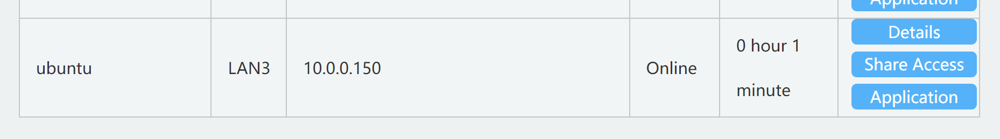

To verify the device is working properly, you can try an included demo by navigating to **http://<your_kit_IP@>**, in my case to http://10.0.0.150 and try some of the examples:

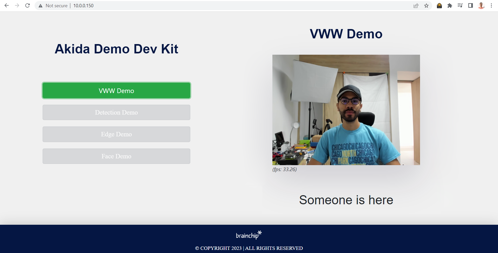

To start setting up the device for a custom model deployment, let's verify we have installed all the packages we need.

I am using Putty for the SSH connection. Log in using the Administrator credentials, in this case, the username is **ubuntu** and the password is **brainchip**.

Once inside you will be able to install some required dependencies:

Running the built-in demos ensures us that the system already counts with its Akida package and the PCIe drivers for the AKD1000 but we can verify it by running the following commands:

`pip show akida` will show the installed version.
`lspci | grep Co-processor` will check if the PCIe card is plugged in correctly.
`python3 --version` will check the installed Python version (3.8 is required).

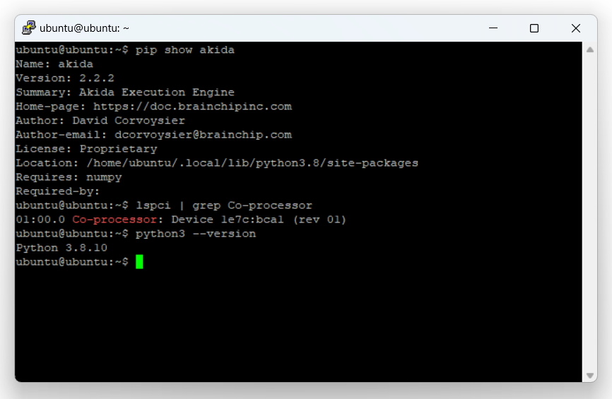

You will also need Node Js v14.x to be able to use the [Edge Impulse CLI](https://docs.edgeimpulse.com/docs/edge-impulse-cli/cli-installation). Install it by running these commands:

```
curl -sL https://deb.nodesource.com/setup_14.x | sudo -E bash -
sudo apt-get install -y nodejs
node -v
```
The last command should return the node version, v14 or above.

Finally, let's install the [Linux Python SDK](https://docs.edgeimpulse.com/docs/edge-impulse-for-linux/linux-python-sdk), you just need to run these commands:

```
$ sudo apt-get install libatlas-base-dev libportaudio0 libportaudio2 libportaudiocpp0 portaudio19-dev 
$ pip3 install edge_impulse_linux -i https://pypi.python.org/simple
```

***As we are working with computer vision, we will need "opencv-python>=4.5.1.48, "PyAudio", "Psutil", and "Flask"***

## Data Collection

First, we need to create an [Edge Impulse Studio](https://studio.edgeimpulse.com) account if we haven't yet, and create a new project:

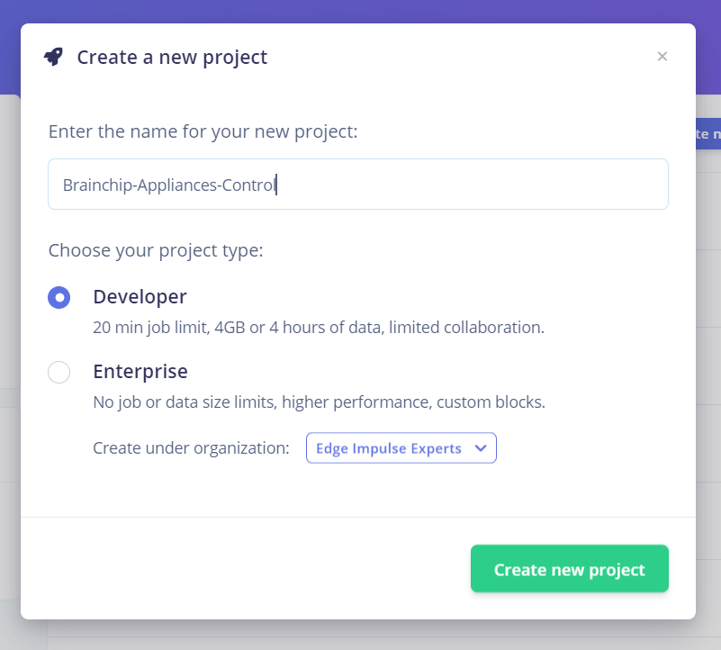

For the creation of the dataset of our model, we have two options, uploading the images from the BrainChip Development Kit or using our computer or phone. In this case, I chose to take them from the computer using the same webcam that we are finally going to use in the project.

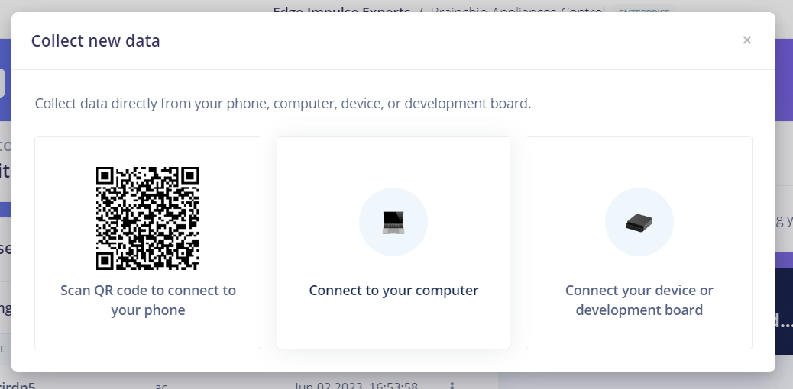

The dataset consists of 3 classes in which we finger point each appliance and a last one of unknown cases.

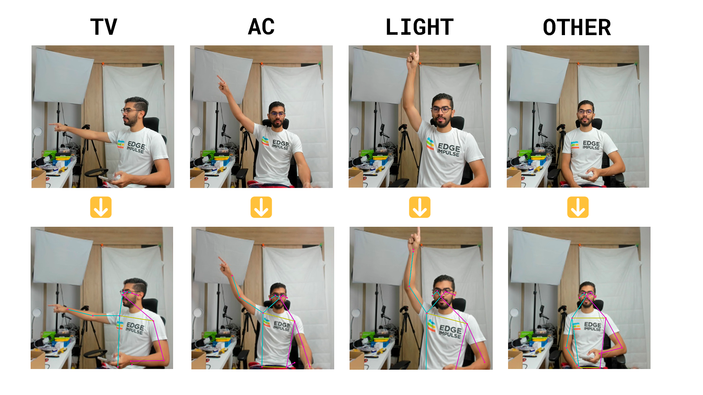

**Taking at least +50 pictures of each class will let you create a robust enough model**

## Impulse Design

After having the dataset ready, it is time to define the structure of the model.

In the left side menu, we navigate to **Impulse design** > **Create impulse** and define the following settings for each block, respectively:

### Input block (Image data):

- Image width: 192
- Image height: 192
- Resize mode: Fit longest

### Processing block (PoseNet):

Use this block to turn raw images into pose vectors, then pair it with an ML block to detect what a person is doing.

PoseNet processing block is just enabled for Enterprise projects, if we want to use it on a Developer one, we need to locally run the block, for this, you must clone the [PoseNet block repository](https://github.com/edgeimpulse/pose-estimation-processing-block) and the README steps.

You will end up with an URL similar to "https://abe7-2001-1308-a2ca-4f00-e65f-1ff-fe27-d3aa.ngrok-free.app" hosting the processing block, click on **Add a processing block** > **Add custom block**, then paste the [**ngrok**](https://ngrok.com/) generated URL, and click on **Add block**.

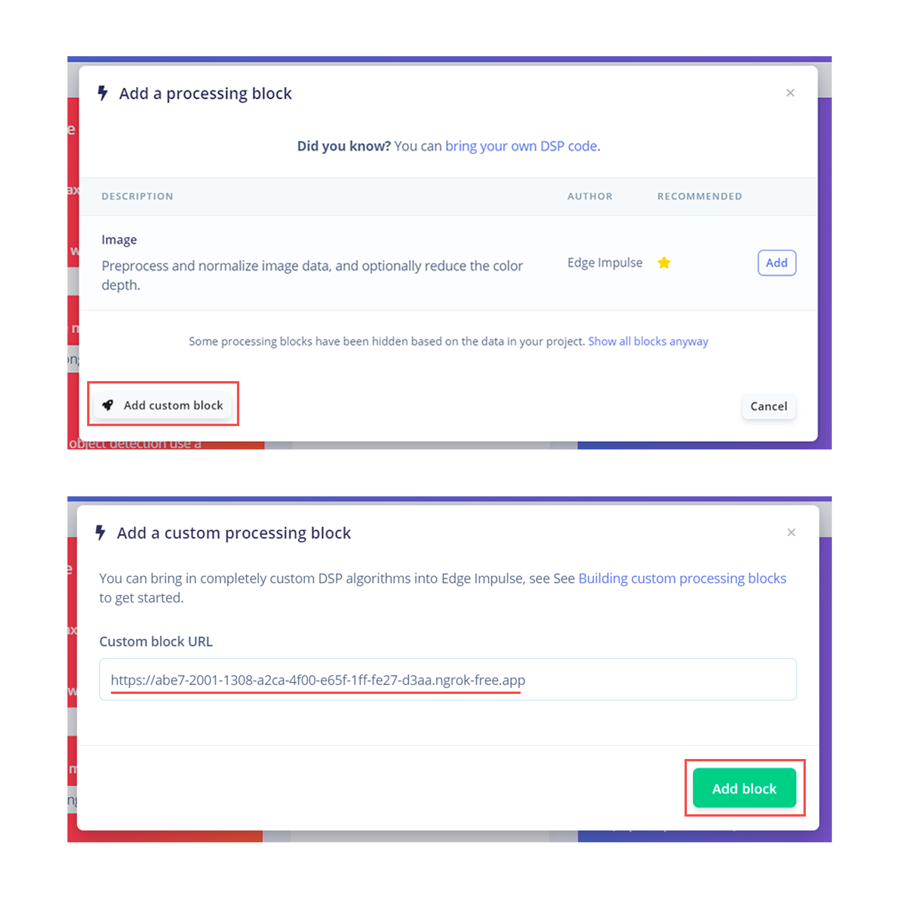

### Learning block (BrainChip Akida)

To classify the features extracted from the different poses, we'll use a classification learn block specifically designed for the hardware we're using.

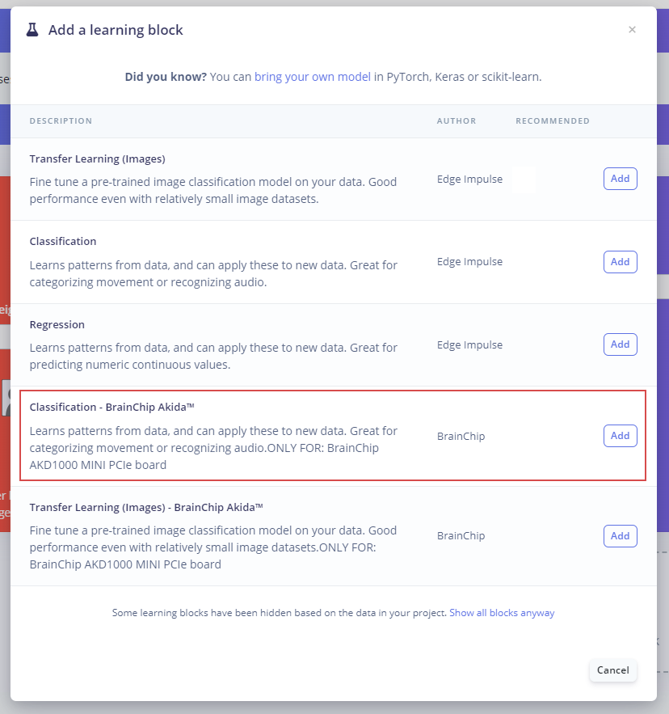

Finally, we save the **Impulse design**, it should end up looking like this:

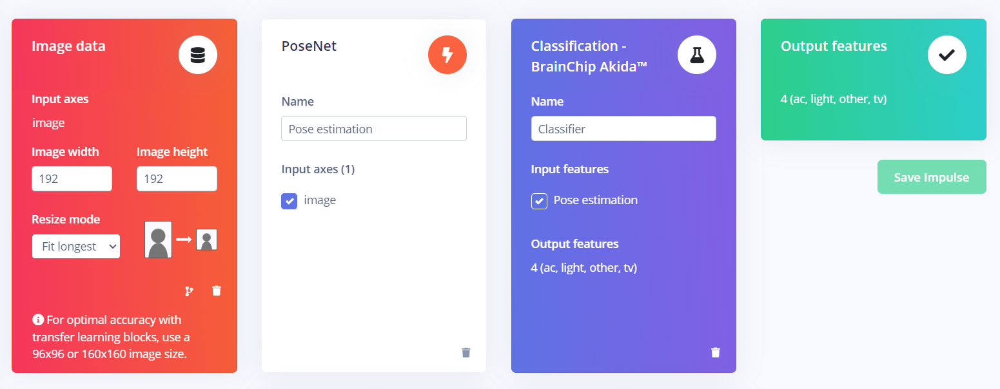

## Model Training

After having designed the impulse, it's time to set the processing and learning blocks. **Pose estimation** block doesn't have any configurable parameters, so we just need to click on **Save parameters** and then **Generate features**. 

In the classifier block define the following in settings:

- Number of training cycles: 200
- Learning rate": 0.0005 

In the Neural network architecture, add 3 Dense layers with 35, 25 and 10 neurons respectively.

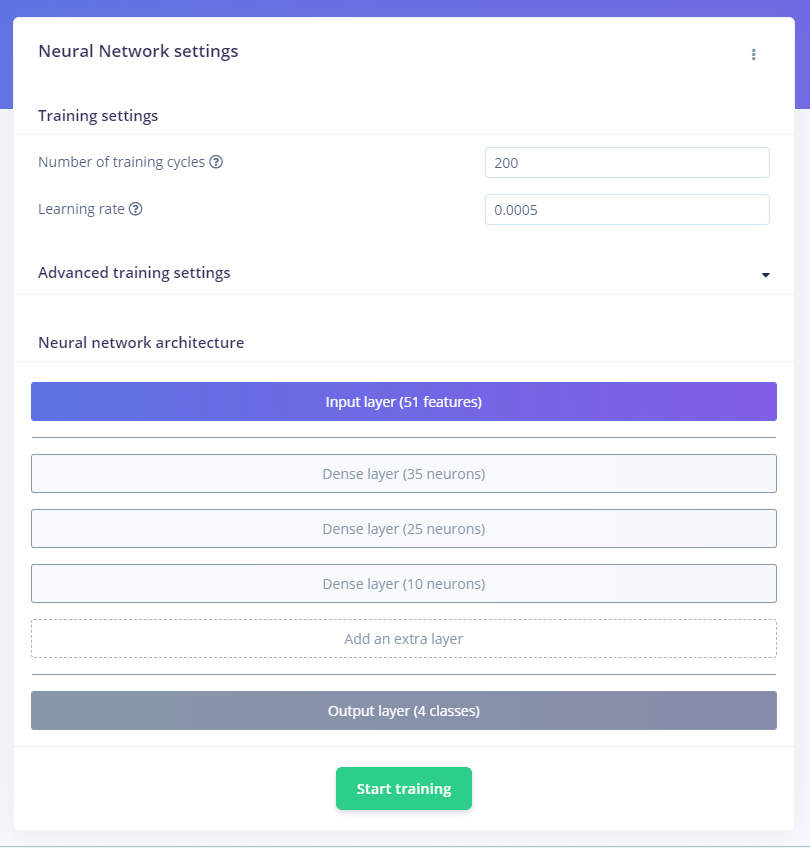

Click on the "train" button and wait for the model to be trained and the confusion matrix to show up.

### Confusion Matrix 

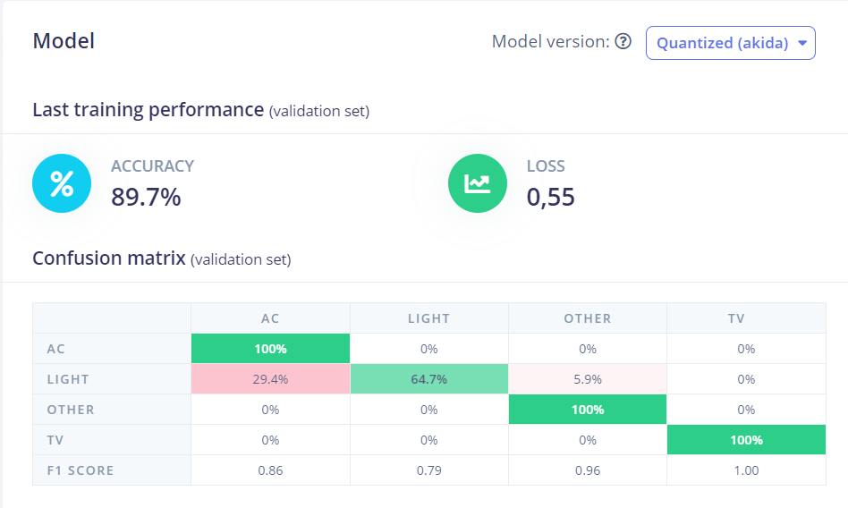

## Model Testing 

To test the model, we need to go back to our SSH connection with the device and download the model to run it locally, you can accomplish this by running this command:

`edge-impulse-linux-runner`

It will ask you for your Edge Impulse account credentials, and then to select your project.

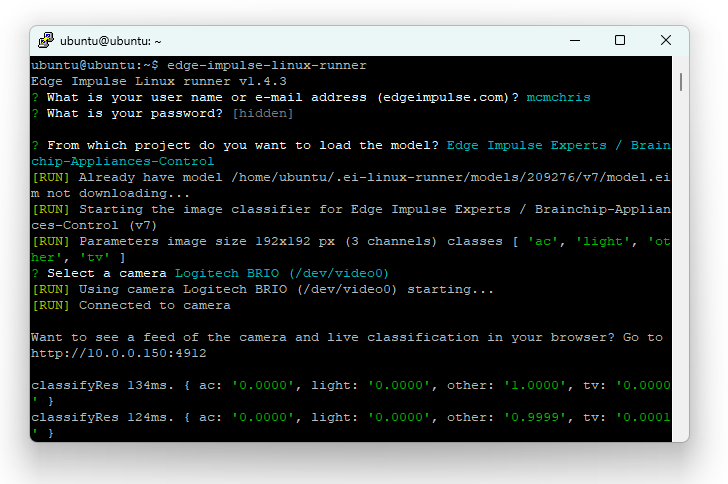

After the model is downloaded, the device will stream a live classification preview on **http://<your_kit_IP:4912>** and start running the inferences.


## Deployment


## Application Development

## Run Inferencing

## Demo

## Conclusion