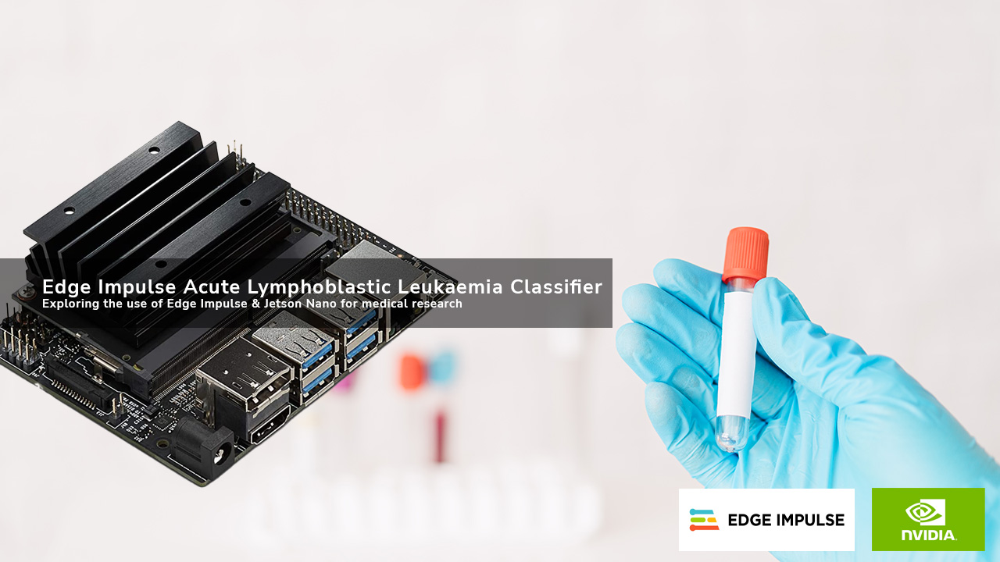
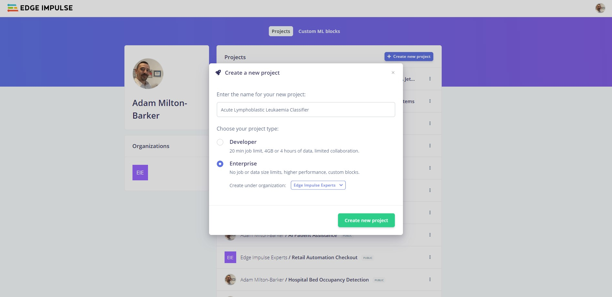
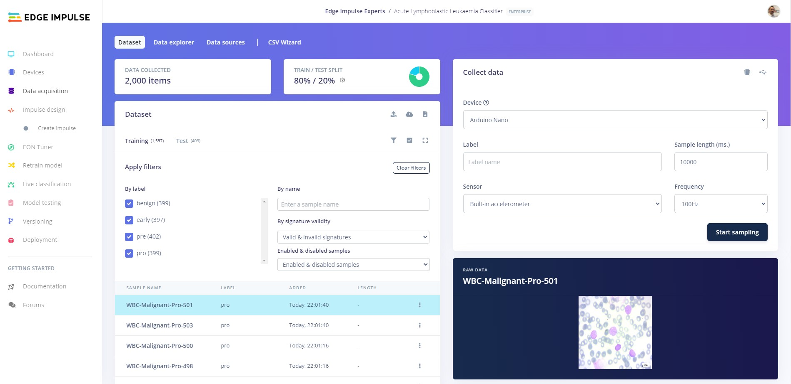
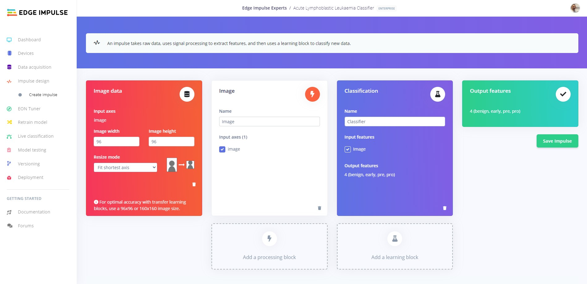
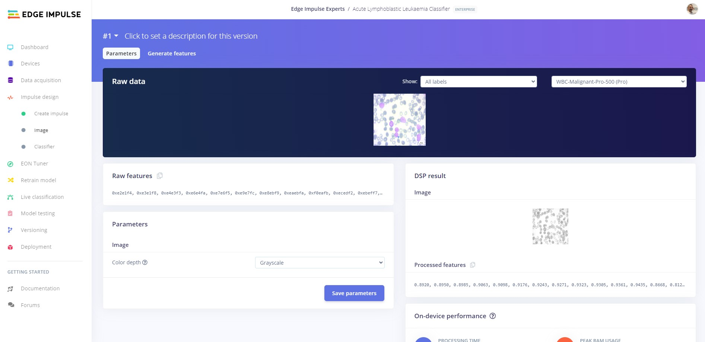
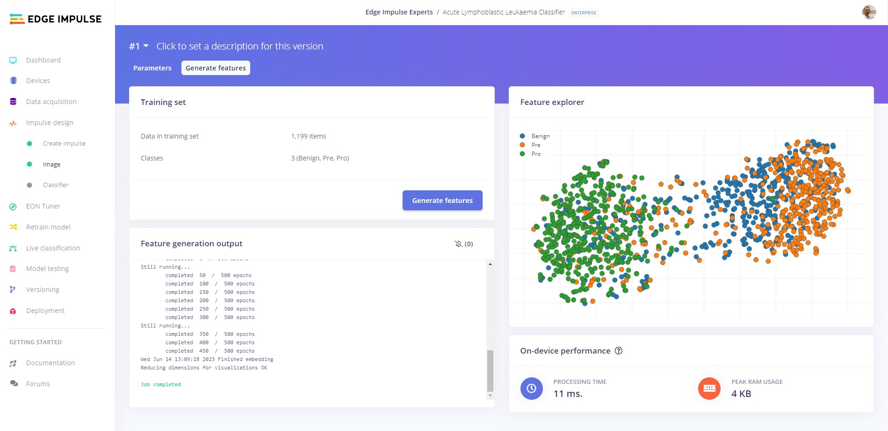
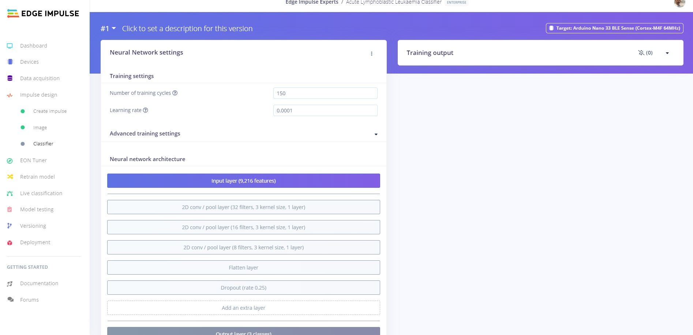
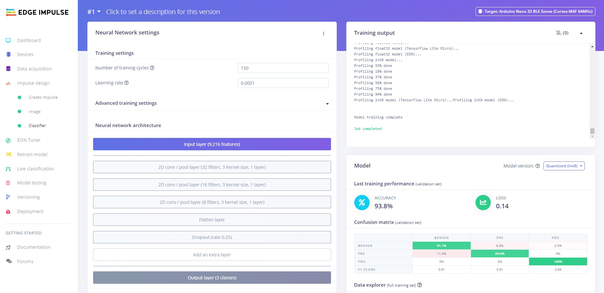
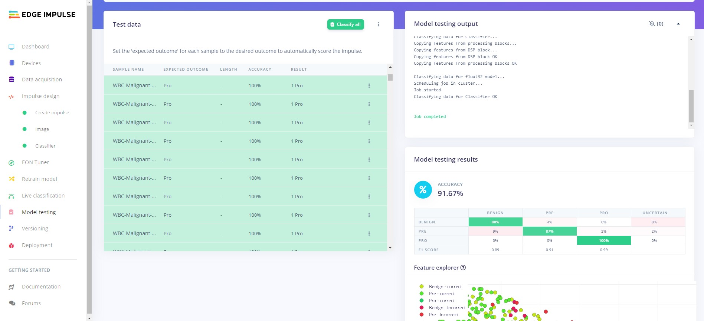

# Acute Lymphoblastic Leukemia Classifier

Created By: [Adam Milton-Barker](https://www.adammiltonbarker.com)

Public Project Link: [https://studio.edgeimpulse.com/public/239144/latest](https://studio.edgeimpulse.com/public/239144/latest)

GitHub Repo: [Edge Impulse Acute Lymphoblastic Leukemia Classifier](https://github.com/AdamMiltonBarker/edge-impulse-all-classifier)



## Introduction

Acute Lymphoblastic Leukemia (ALL), also known as acute lymphocytic leukemia, is a cancer that affects the lymphoid blood cell lineage. It is the most common leukemia in children, and it accounts for 10-20% of acute leukemias in adults. The prognosis for both adult and especially childhood ALL has improved substantially since the 1970s. The 5-year survival is approximately 95% in children. In adults, the 5-year survival varies between 25% and 75%, with more favorable results in younger than in older patients.

Since 2018 I have worked on numerous projects exploring the use of AI for medical diagnostics, in particular, leukemia. In 2018 my grandfather was diagnosed as terminal with Acute Myeloid leukemia one month after an all clear blood test completely missed the disease. I was convinced that there must have been signs of the disease that were missed in the blood test, and began a research project with the goals of utilizing Artificial Intelligence to solve early detection of leukemia. The project grew to a non-profit association in Spain and is now a UK community interest company.

## Investigation

One of the objectives of our mission is to experiment with different types of AI, different frameworks/programming languages, and hardware. This project aims to show researchers the potential of the Edge Impulse platform and the NVIDIA Jetson Nano to quickly create and deploy prototypes for medical diagnosis research.

## Hardware

* NVIDIA Jetson Nano [Buy](https://developer.nvidia.com/embedded/jetson-nano-developer-kit)

## Platform

* Edge Impulse [Visit](https://www.edgeimpulse.com)

## Software

* [Edge Impulse Linux SDK for Python](https://github.com/edgeimpulse/linux-sdk-python)

## Dataset

For this project we are going to use the [Acute Lymphoblastic Leukemia (ALL) image dataset](https://www.kaggle.com/datasets/mehradaria/leukemia). Acute Lymphoblastic Leukemia can be either T-lineage, or B-lineage. This dataset includes 4 classes: Benign, Early Pre-B, Pre-B, and Pro-B Acute Lymphoblastic Leukemia.

Pre-B Lymphoblastic Leukemia, or precursor B-Lymphoblastic leukemia, is a very aggressive type of leukemia where there are too many B-cell lymphoblasts in the bone marrow and blood. B-cell lymphoblasts are immature white blood cells that have not formed correctly. The expressions ("early pre-b", "pre-b" and "pro-b") are related to the differentiation of B-cells. We can distinguish the different phases based on different cell markers expression, although this is complex because the "normal profile" may be altered in malignant cells.

We had quite a lot of issues with the early class, this will be due to the fact the features of the different classes are very similar, especially so with the early class and benign as the early class represents the cells at the earliest stage of growth and is very close to the benign class.

## Project Setup

Getting started is as simple as heading to [Edge Impulse](https://www.edgeimpulse.com) and create your account or login. Once logged in you will be taken to the project selection/creation page.

### Create New Project

From the project selection/creation page you can create a new project.



Enter a **project name**, select **Developer** or **Enterprise** and click **Create new project**.

### Import Data

Now it is time to import your data. You should have already downloaded the dataset from Kaggle, if not you can do so now on [this link](https://www.kaggle.com/datasets/mehradaria/leukemia).


Once downloaded head over the to **Data acquisition** in Edge Impulse Studio, click on the **Add data** button and then **Upload data**.


From here, choose 500 images from each class, ensuring you enter the label for the relevant class each time. The classes are not balanced so select around 500 images from each class, make sure to remember which images you have not used as we will use some to classify on device later.



By the time you have finished uploading you should have 2000 images uploaded into 4 classes, with an 80% / 20% train/test split.

## Create Impulse



The next step is to create your Impulse. Head to the **Create Impulse** tab. Next click **Add processing block** and select **Image**.

Now click **Add learning block** and select **Classification** then click **Save impulse**.

### Image

#### Parameters



Head over to the **Images** tab and change the color depth to grayscale, then click on the **Save parameters** button to save the parameters.

#### Generate Features



If you are not automatically redirected to the **Generate features** tab, click on the **Image** tab and then click on **Generate features** and finally click on the **Generate features** button to generate the features.

## Training



The next step is to train our model. Click on the **Classifier** tab then change the number of training cycles to 150 and add an additional 2D conv/pool layer with 8 filter, 3 kernel size, and 1 layer to the network as shown in the image above. Now you are ready to start training, click the **Start training**.



Once training has completed, you will see the results displayed at the bottom of the page. Here we see that the model achieved 93.8% accuracy. Lets test our model and see how it works on our test data.

## Platform Testing

Let's see how the model performs on unseen data. Head over to the **Model testing** tab where you will see all of the unseen test data available. Click on the **Classify all** and sit back as we test our model.



You will see the output of the testing in the output window, and once testing is complete you will see the results. In our case we can see that we have achieved 91.67% accuracy on the unseen data.

## Jetson Nano Setup

Now we are ready to set up our Jetson Nano project.

### Python SDK

To deploy our model on our NVIDIA Jetson Nano, we are going to use the [Edge Impulse Linix SDK](https://github.com/edgeimpulse/linux-sdk-python/).

On your Jetson Nano, run the following command and connect to the platform:

```
edge-impulse-linux-runner --download modelfile.eim
```

Once the script has finished running you will see a similar output to below:

```
[BLD] Building binary OK
[RUN] Downloading model OK
[RUN] Stored model in /home/jetson-nano/modelfile.eim
```

### Software

For this project you will need `opencv-python>=4.5.1.48`. Make sure you have installed it on your Jetson Nano.

### Clone The Repository

Now you can clone this project's GitHub repository to your Jetson Nano. Navigate to the location you would like to clone the repo to and use the following commands:

```
git clone https://github.com/AdamMiltonBarker/edge-impulse-all-classifier.git
```

### Move Your Model

Now move the model you downloaded earlier into the `model` directory of the cloned repo, modifying your path as required:

```
mv /home/jetson-nano/modelfile.eim /home/jetson-nano/edge-impulse-all-classifier/model
```

### Add Your Data

Now it is time to add some test data to your device, ensuring that you are not using any data that has already been uploaded to the Edge Impulse platform. You can use additional images from the Kaggle dataset, or your own data. Place the images into the `data` folder of the cloned repo on your Jetson Nano.

### Code

The code has been provided for you in the `classifier.py` file. To run the classifier use the following command:

```
python3 classifier.py
```

You should see similar to the following output. In our case, our model performed exceptionally well at classifying the various stages of leukemia, only classifying 3 samples out of 14 incorrectly.

```
Loaded runner for "Edge Impulse Experts / Acute Lymphoblastic Leukemia Classifier"

Loaded test image: data/WBC-Malignant-Pre-741.jpg
Benign: 0.17    Pre: 0.83       Pro: 0.00
Ground: Pre
Classification: Pre with 0.8257818818092346 confidence
Result: Correctly classified Pre sample in 0.019216299057006836 seconds

Loaded test image: data/WBC-Malignant-Pre-707.jpg
Benign: 0.59    Pre: 0.41       Pro: 0.00
Ground: Pre
Classification: Benign with 0.586258053779602 confidence
Result: Incorrectly classified Benign sample in 0.012994766235351562 seconds

Loaded test image: data/WBC-Malignant-Pre-703.jpg
Benign: 0.79    Pre: 0.21       Pro: 0.00
Ground: Pre
Classification: Benign with 0.7909294962882996 confidence
Result: Incorrectly classified Benign sample in 0.012796640396118164 seconds

Loaded test image: data/WBC-Benign-504.jpg
Benign: 1.00    Pre: 0.00       Pro: 0.00
Ground: Benign
Classification: Benign with 0.9996868371963501 confidence
Result: Correctly classified Benign sample in 0.012486934661865234 seconds

Loaded test image: data/WBC-Malignant-Pre-696.jpg
Benign: 0.29    Pre: 0.71       Pro: 0.00
Ground: Pre
Classification: Pre with 0.7090908288955688 confidence
Result: Correctly classified Pre sample in 0.012774467468261719 seconds

Loaded test image: data/WBC-Benign-501.jpg
Benign: 1.00    Pre: 0.00       Pro: 0.00
Ground: Benign
Classification: Benign with 0.999911904335022 confidence
Result: Correctly classified Benign sample in 0.012662410736083984 seconds

Loaded test image: data/WBC-Malignant-Pro-560.jpg
Benign: 0.05    Pre: 0.00       Pro: 0.95
Ground: Pro
Classification: Pro with 0.9516651034355164 confidence
Result: Correctly classified Pro sample in 0.012473106384277344 seconds

Loaded test image: data/WBC-Malignant-Pro-536.jpg
Benign: 0.03    Pre: 0.00       Pro: 0.97
Ground: Pro
Classification: Pro with 0.9714751243591309 confidence
Result: Correctly classified Pro sample in 0.012613773345947266 seconds

Loaded test image: data/WBC-Malignant-Pro-629.jpg
Benign: 0.07    Pre: 0.00       Pro: 0.93
Ground: Pro
Classification: Pro with 0.9335078597068787 confidence
Result: Correctly classified Pro sample in 0.012687444686889648 seconds

Loaded test image: data/WBC-Benign-502.jpg
Benign: 0.98    Pre: 0.00       Pro: 0.02
Ground: Benign
Classification: Benign with 0.980989933013916 confidence
Result: Correctly classified Benign sample in 0.012753963470458984 seconds

Loaded test image: data/WBC-Benign-503.jpg
Benign: 0.99    Pre: 0.00       Pro: 0.01
Ground: Benign
Classification: Benign with 0.9916738867759705 confidence
Result: Correctly classified Benign sample in 0.012406110763549805 seconds

Loaded test image: data/WBC-Malignant-Pro-592.jpg
Benign: 0.06    Pre: 0.00       Pro: 0.94
Ground: Pro
Classification: Pro with 0.9429842829704285 confidence
Result: Correctly classified Pro sample in 0.013579130172729492 seconds

Loaded test image: data/WBC-Malignant-Pro-656.jpg
Benign: 0.11    Pre: 0.00       Pro: 0.89
Ground: Pro
Classification: Pro with 0.8878546357154846 confidence
Result: Correctly classified Pro sample in 0.012981414794921875 seconds

Loaded test image: data/WBC-Malignant-Pre-750.jpg
Benign: 0.84    Pre: 0.16       Pro: 0.00
Ground: Pre
Classification: Benign with 0.8409590125083923 confidence
Result: Incorrectly classified Benign sample in 0.012578725814819336 seconds

Classifications finished 14 in 0.18500518798828125 seconds
```

## Conclusion

In this demonstration, we have illustrated the potential of combining the Edge Impulse platform with the computational capabilities of the NVIDIA Jetson for swiftly prototyping medical research applications, such as early detection of leukemia.

Although this program is not yet capable of addressing the challenges associated with early detection or serving as a practical real-world solution, it serves as a valuable tool for medical and AI researchers, offering insights and aiding in the advancement of their respective fields.
